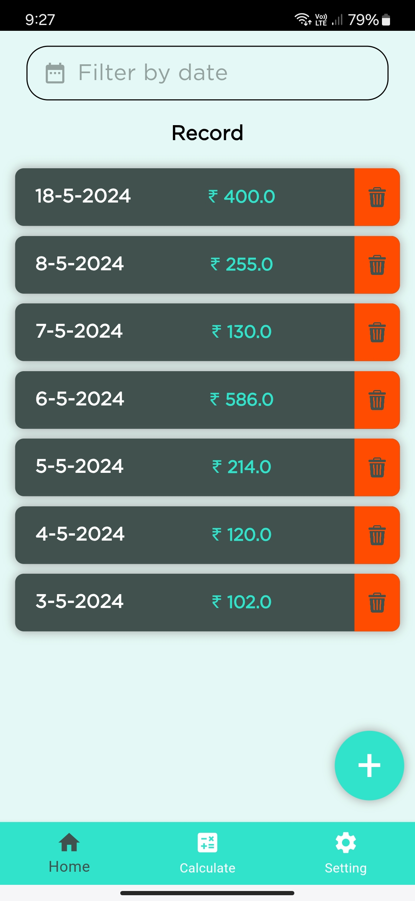

 
<h1 align="center">myExpenses</h1>

**myExpenses** is the ultimate expense tracker app designed to help you manage and track your daily spending with ease. The app offers various features to help you stay organized and make informed financial decisions.

## Features

- **Daily Expense Logging**: Easily add and categorize your daily expenses.
- **Daily Totals**: View the total amount spent each day.
- **Date Filtering**: Display expenses for specific days using the date filter.
- **Range-Based Expense Calculation**: Calculate total expenses over a selected date range.
- **Cloud Storage**: Securely store your data in the cloud, ensuring accessibility from any device.

## Screenshorts (mobile)

|  |  |  |  |  |  |
| :--: | :--: | :--: | :--: | :--: | :--: |
| Auth screen | Home screen | Details screen | Data entry / edit | Calculator | Setting / Account |

## Why i  made this app ?
 To solve my own problem. That's it.
 
## Download
You can download app from release section.
 
## Contributing
 We welcome contributions to improve myExpenses.

### License

    Copyright 2024, Raj Ukani
    All rights reserved.
    
    This source code is licensed under the MIT license found in the
    LICENSE file in the root directory of this source tree.